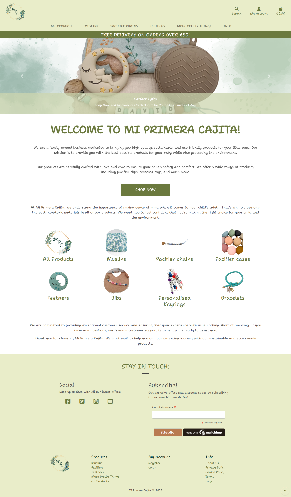
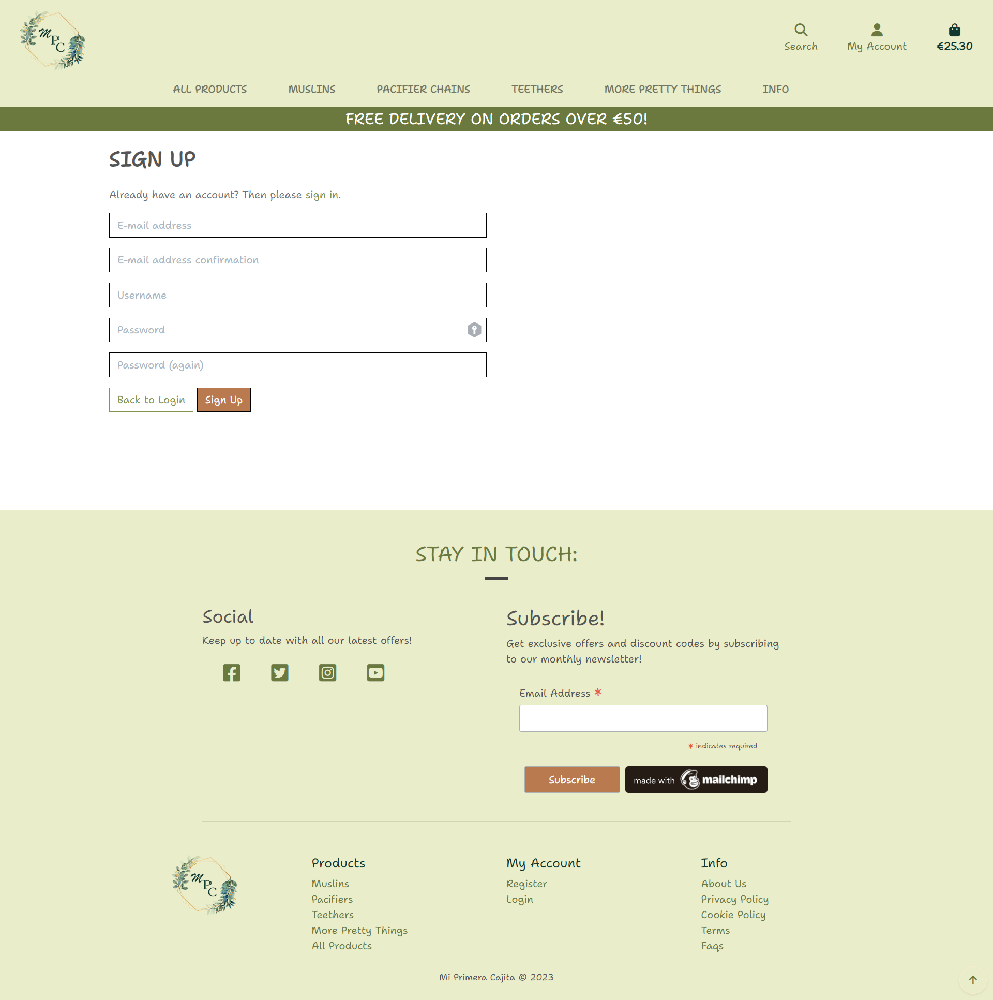
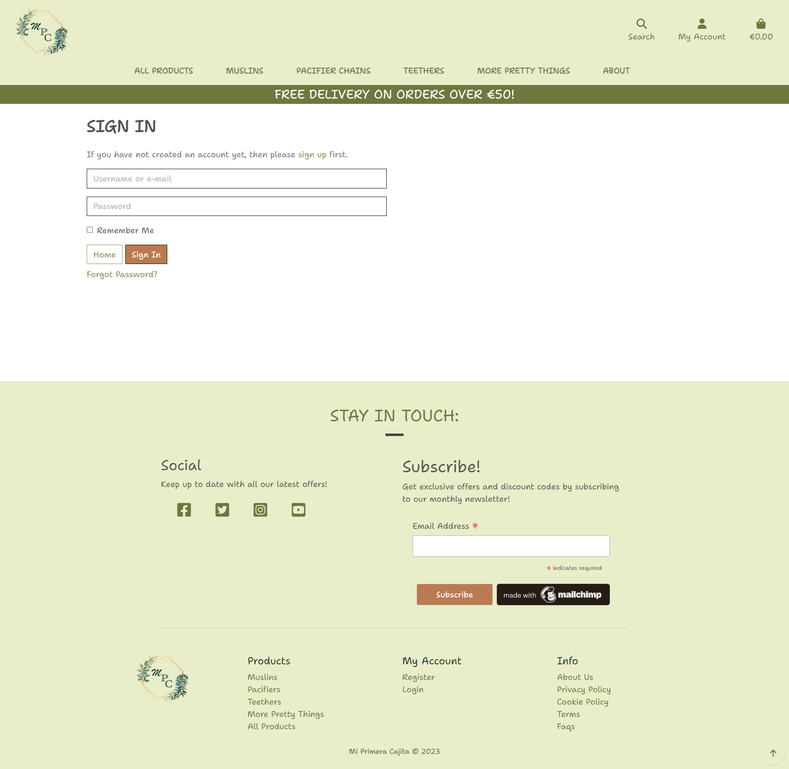
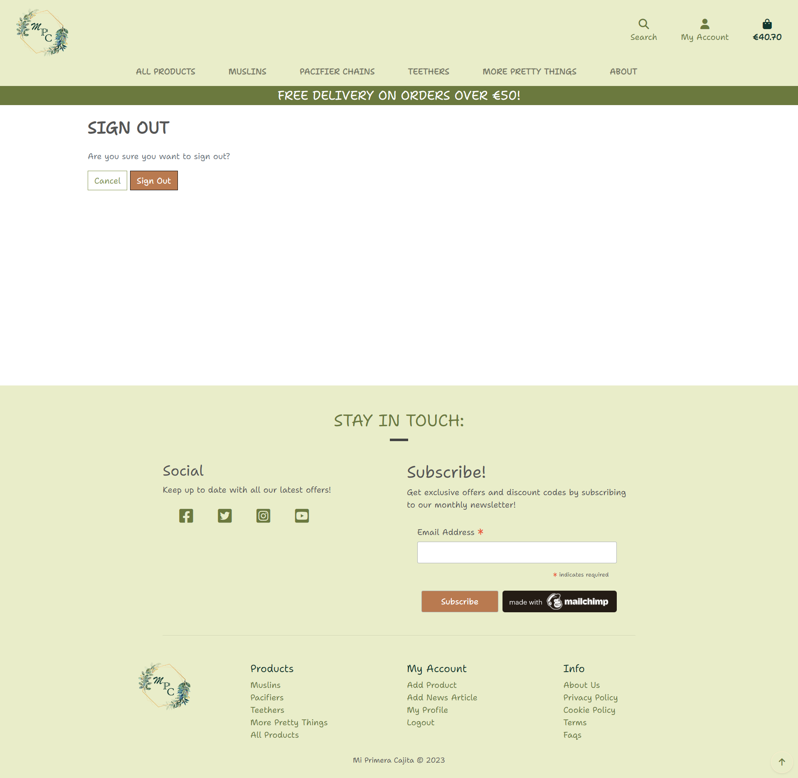
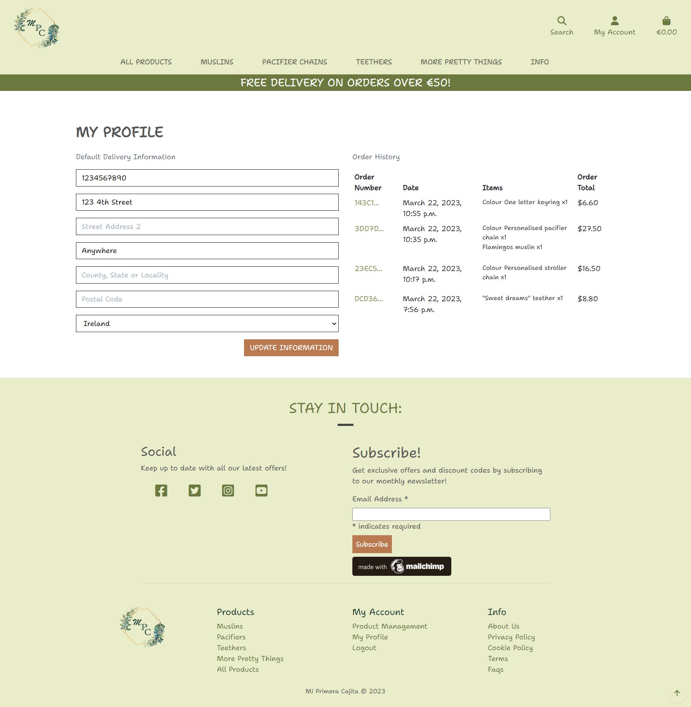
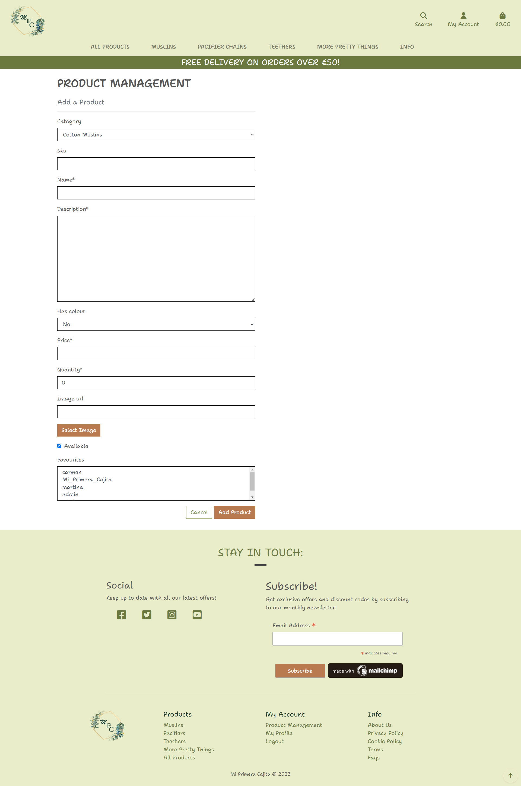
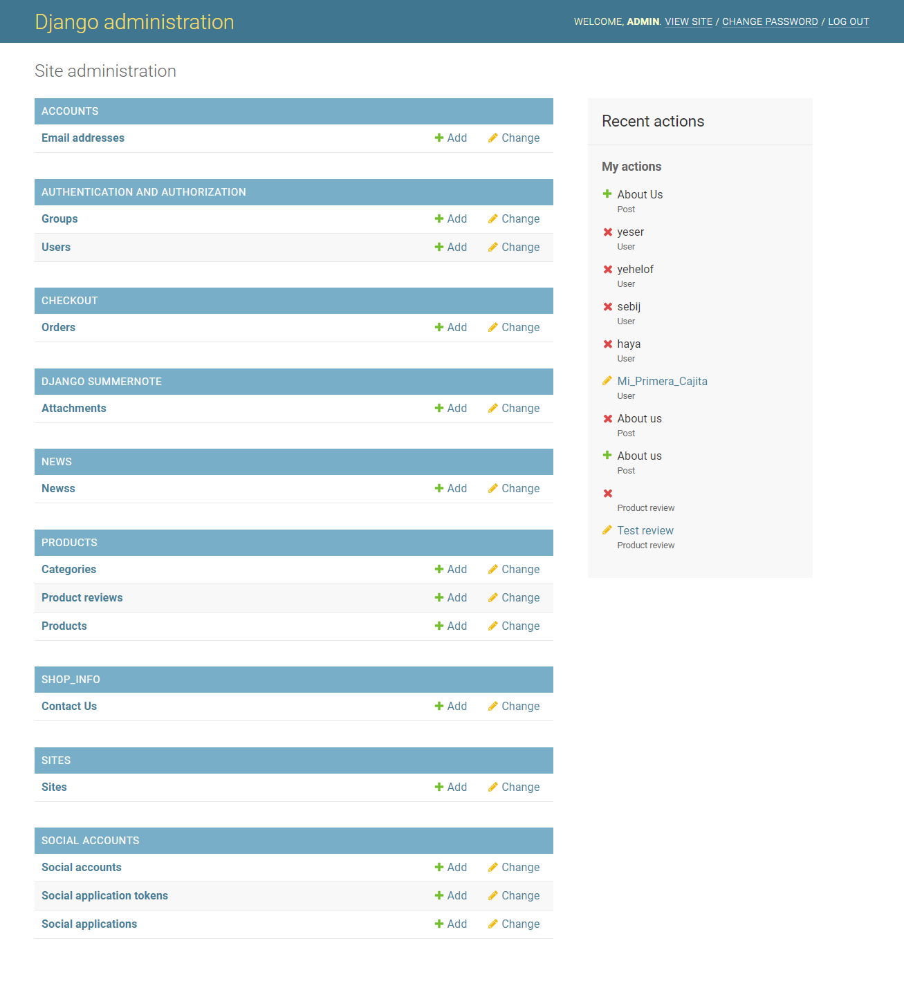

# My First Box


The Live Website can be accessed [HERE!](https://.herokuapp.com/)

This is an e-commerce website selling personalised baby products (cord for the pacifier or the teether, bibs, muslins, case to store the teether or pacifier or whatever you want) as a first present for the new-born. The site’s main purpose is to allow users to browse and view baby products whether they are registered or not. Registered users can also buy products, change their information, add them to favourites, like or dislike products, and leave comments that can be updated or deleted by the user.

## Table of Contents

- [My First Box](#my-first-box)
  - [Table of Contents](#table-of-contents)
  - [Features](#features)
    - [Existing Features](#existing-features)
      - [Home Page](#home-page)
        - [Navigation \& Viewing](#navigation--viewing)
        - [Purchasing \& Checkout](#purchasing--checkout)
        - [Searching \& Sorting](#searching--sorting)
        - [Store Info Pages](#store-info-pages)
      - [Products Page](#products-page)
      - [Products Details Page](#products-details-page)
      - [Comments section](#comments-section)
      - [User Registration \& Profile Account](#user-registration--profile-account)
      - [Store Owner Panel Page](#store-owner-panel-page)
      - [Store Owner Add Products Page](#store-owner-add-products-page)
      - [Store Owner Edit Products Page](#store-owner-edit-products-page)
      - [Store Owner Delete Products Page](#store-owner-delete-products-page)
      - [Store Owner Orders Page](#store-owner-orders-page)
      - [Admin Control](#admin-control)
    - [Future Features](#future-features)
  - [UX](#ux)
    - [Site Purpose](#site-purpose)
    - [Agile Methodology](#agile-methodology)
    - [User Stories](#user-stories)
  - [Design](#design)
    - [Flow Diagram](#flow-diagram)
  - [Testing](#testing)
    - [User Testing](#user-testing)
    - [Manual Testing](#manual-testing)
    - [Bugs to fix](#bugs-to-fix)
  - [Technologies Used](#technologies-used)
  - [Deployment](#deployment)
    - [GitHub](#github)
    - [Django and Heroku](#django-and-heroku)
      - [Final Deployment](#final-deployment)
    - [How to Fork it](#how-to-fork-it)
    - [How to Clone it](#how-to-clone-it)
    - [Making a Local Clone](#making-a-local-clone)
  - [Credits](#credits)

## Features

### Existing Features

#### Home Page



##### Navigation & Viewing

The website has a user-friendly navigation system that allows customers to easily browse and search for products. They can view products in list form and see detailed product descriptions, including customer reviews, to make informed purchasing decisions.


##### Purchasing & Checkout

Customers can add products to their cart, select product size and quantity, and securely checkout using various payment options. They receive confirmation of their order and a confirmation email after checkout.


##### Searching & Sorting

Customers can search for products by name, category, or keyword and sort them by price, popularity, or other filters.

##### Store Info Pages

Customers can access relevant company information, such as the company's mission statement, privacy policy, and shipping and return policies.

#### Products Page


#### Products Details Page


#### Comments section

<details>
  <summary>Comments section</summary>


- Leave a comment


- Comment Approval


- Edit Comment Page


- Delete Comment Page


</details>

#### User Registration & Profile Account

Users can register for an account and create a profile where they can manage their personal information, view order history, and add/edit shipping addresses.

<details>
  <summary>User/Costumer Account Pages</summary>

- Register page



- Login page



- Logout page



- Profile page



</details>

<details>
  <summary>Store Owner Pages</summary>

#### Store Owner Panel Page


#### Store Owner Add Products Page



#### Store Owner Edit/Delete Products Page


#### Store Owner Orders Page


</details>

#### Admin Control



[Back to top](#my-first-box)

### Future Features

In the future, we plan to add more products to our inventory, including personalised baby blankets and clothing. We also plan to offer gift wrapping options for customers who wish to purchase items as gifts. Additionally, we will continue to improve our website's user interface and security features to provide the best possible online shopping experience for our customers.

[Back to top](#my-first-box)

## UX

### Site Purpose

- To provide a user-friendly and secure online shopping experience for customers looking to purchase personalised baby products.

### Agile Methodology

The Agile Methodology was used to plan and manage this project. Epics and Issues were created on GitHub so that tasks could be assigned and prioritised using the Project Board.

### User Stories

-

[Back to top](#my-first-box)

## Design

The colour scheme for the design of the website is based in warn nature colours.


### Flow Diagram


The flow chart above, created with the website [Lucid chart](https://lucid.app/), provides a simplified overview of what I was trying to accomplish.

[Back to top](#my-first-box)

## Web Marketing Strategy

This app was built using insights gained from the Design Thinking phase, keyword research, SEO, XML sitemap, robots.txt file, MailChimp, and Facebook as part of our web marketing strategy. These specific features were introduced to enhance the marketing of our business.

### Search Engine Optimisation (SEO)

As an e-commerce website, our users need to find personalized baby products easily and quickly. To meet those needs, we provide a user-friendly interface that allows them to browse and filter our products based on their preferences. We also offer detailed product descriptions, images, and customer reviews to help users make informed decisions.

To make the information easy to understand, we use simple language and clear visuals. We also organize our products into categories and provide filters to help users narrow down their search.

To demonstrate expertise, authoritativeness, and trustworthiness, we include information about our company and team, as well as any certifications or awards we have received. We also make sure to use accurate and up-to-date information throughout our website.

There are opportunities to link back to other pages within our own site, such as related products or product bundles. We can also link to external websites that already rank highly on Google, such as parenting blogs or baby product review websites.
To help users discover other relevant parts of our web application, we include related products, recommended products, and product bundles on our product pages. We also have a search bar and navigation menu that allow users to explore our website more easily.

**_Short-tail and long-tail keywords_**

- Personalised baby products
- Pacifier cords
- Teethers
- Bibs
- Muslins
- Baby gifts
- New-born essentials
- Baby shower gifts
- Newborn baby accessories
- Customisable baby products
- Pacifier clips
- Bibs and burp cloths
- Teething toys
- Muslin blankets
- Baby product storage
- Unique baby products
- Handmade baby products
- Baby product safety

[Back to top](#my-first-box)

### Web Marketing

- Users:

As an e-commerce shop selling personalised baby products, the users of this website are likely to be parents, expecting parents, family members and friends of parents, or anyone looking for a unique and personalized gift for a newborn baby.

- Online platforms:

It is common for these types of e-commerce shops to find a lot of their users on popular online platforms such as search engines like Google, social media sites like Facebook and Instagram, and marketplaces like Amazon and eBay.

- Social media users:

Social media platforms can be effective for reaching and engaging with potential customers. The specific social media platforms that the users of this e-commerce shop might use can depend on various factors such as demographics, interests, and location. It is recommended for the e-commerce shop to conduct market research to identify the social media platforms that their target audience is most active on and develop a social media strategy to reach and engage with them.

- User's needs:

The users may need information about the products, their features, and usage guidelines. They may also need help with choosing the right product for their needs, as well as assistance with the ordering and delivery process.

One way to meet these needs is by providing high-quality product descriptions, including images and videos that showcase the products' features and benefits. Additionally, creating informative blog posts, tutorials, and frequently asked questions (FAQs) can help users make informed decisions and provide solutions to their problems.

To deliver this content to the users, the e-commerce shop could create a blog section on its website and share posts on social media platforms. The website could also have a prominent "Help" or "Support" section that provides information on frequently asked questions and ordering and delivery processes.

Email marketing campaigns could also be used to deliver useful content to users who have subscribed to the shop's mailing list. The emails could include product updates, promotions, and helpful tips and guides.

Overall, the key is to create content that is informative, engaging, and easy to understand, and to make it easily accessible to users through multiple channels.

- Running sales or offer discounts:

Running sales and offering discounts can be an effective way to attract and retain customers. To inform our users about these offers, we’ll consider using various marketing channels such as email marketing, social media, and pop-up notifications on our website. We’ll also offer exclusive discounts to subscribers of our email list or followers on social media platforms to encourage them to engage with our brand and stay updated on promotions.

- Business goals:

As an e-commerce business, the goals of this business include increasing sales, generating brand awareness, and building customer loyalty. Some marketing strategies that will help meet these goals include:

1. Search Engine Optimization (SEO): By optimizing the website's content and structure for search engines, the business can increase its visibility in search results and attract more traffic to the website.

2. Pay-Per-Click Advertising (PPC): Using platforms like Google Ads or Facebook Ads, the business can create targeted ads that reach potential customers based on their demographics, interests, and behaviours.

3. Social Media Marketing: By creating and sharing engaging content on social media platforms like Instagram and Facebook, the business can build a following and connect with potential customers.

4. Email Marketing: By building an email list of subscribers and sending regular newsletters and promotions, the business can keep its brand top-of-mind and encourage repeat purchases.

5. Influencer Marketing: Partnering with influencers in the baby and parenting niche can help the business reach a wider audience and generate buzz around its products.

- Business budget:

It's possible that this business might need to work with free or low-cost options to market itself, especially if it has a limited marketing budget. There are many effective ways to market a business without spending a lot of money, such as social media marketing, email marketing, content marketing, influencer marketing, and search engine optimization (SEO). By focusing on these strategies and creating high-quality, engaging content that resonates with their target audience, this business can effectively market itself and grow its customer base without breaking the bank.

[Back to top](#my-first-box)

### XML Sitemap

The website App includes a sitemap file containing a list of important URLs. This file helps search engine spiderbots crawl the business website quickly and retrieve all relevant content.

The sitemap file was created using [XML-Sitemaps.com](https://www.xml-sitemaps.com/): https://www.xml-sitemaps.com/.

### Robots

The robots.txt file was implemented to guide search engine spider bots on which parts of the website to avoid, leading to better site quality and ultimately improving our SEO rating. We received assistance in setting up this feature from Walkthrough Boutique Ado.

## Testing

The website was constantly tested during development.

### User Testing

- User Testing:

  - Expectations:

  - Result:

### Manual Testing

|            **Navigation Bar**             | Status  |
| :---------------------------------------: | :------ |
|   Click on navbar logo loads home page    | &check; |
| Click on the Home tab loads the home page | &check; |
|    Click on Login loads the login page    | &check; |
|   Click on Signup loads the signup page   | &check; |
|   Click on Logout loads the logout page   | &check; |

|           **Navigation Footer**           | Status  |
| :---------------------------------------: | :------ |
| Click on Facebook Icon opens external Tab | &check; |
|    Click on Twitter opens external Tab    | &check; |
|   Click on Instagram opens external Tab   | &check; |
|    Click on YouTube opens external Tab    | &check; |

|               **Home Page**               | Status  |
| :---------------------------------------: | :------ |
| Sign up and Login visible when logged out | &check; |
| Logout and Profile visible when logged in | &check; |
|      Username visible when logged in      | &check; |

### Bugs to fix

[Back to top](#my-first-box)

## Technologies Used

- HTML: Used to structure all the templates on the site.
- CSS: To provide extra styling to the site.
- Python: To provide the functionality to the site. Packages used in the project can be found in requirements.txt.
- Django: Python framework used in the project.
- JavaScript: Minimum JavaScript was used to fade out alerts.
- Bootstrap 4: To create layouts and styles for the website.
- [GitHub](https://github.com/): Used to store my repository for submission.
- [Gitpod](https://gitpod.io/): Used to develop the application.
- GitBash: Used to push the repository to GitHub.
- [Heroku](https://www.heroku.com/): Used to deploy the website.
- [ElephantSQL](https://www.elephantsql.com/): Used for the database during development and deployment.
- [Amazon AWS](https://aws.amazon.com/): To host static and media files for the site.
- [Lucid chart](https://www.lucidchart.com/): Used to make a flow diagram to help with the logic & flow of the code.
- [Balsamiq](https://balsamiq.com/): To create wireframes for the project.
- [Am I Responsive?](https://ui.dev/amiresponsive): To ensure the project looked good across all devices.
- [Favicon](https://favicon.io/favicon-converter/) - To create the favicon icon.

[Back to top](#my-first-box)

## Deployment

This project was deployed using

- Github - To store code and deploy the site.
- ElephantSql.com - To create an external database.
- Django and Heroku - To host the deployed project.
- Amazon AWS - To host the static and media files.

### GitHub

To create a new repository, I took the following steps:

1. Logged into GitHub.
2. Click the ‘repositories’ section.
3. Click the green ‘new’ button to create new repository.
4. Choose ‘repository template’ Used the code institute template as recommended from the dropdown menu.
5. Add repository name then clicked the green ‘create repository button’ at the bottom of the page.
6. Open the new repository and clicked the green ‘Gitpod’ button to create a workspace in Gitpod for editing.

### ElephantSql

Setting up ElephantSQL:

1. Access your ElephantSQL dashboard by logging in to ElephantSQL.com.
2. Click on "Create New Instance".
3. Set up your plan by giving it a name (usually the name of your project), selecting the Tiny Turtle (Free) plan, and leaving the Tags field blank.
4. Click on "Select Region" and then click on "Review".
5. Check your details and then click on "Create instance".
6. Go back to the ElephantSQL dashboard and click on the name of the database instance for your project.
7. To copy the database URL to your clipboard, click on the copy icon in the URL section.

### Django and Heroku

To set up the Django framework and configure the Heroku deployment, I followed these step-by-step instructions:

1. Installed Django framework and revisited the Walkthrough provided by Code institutes for assistance.
2. Logged into Heroku, went to the Dashboard and clicked on New to create a new app.
3. Gave the app a name, selected the region closest to me, and clicked Create app to confirm.
4. Opened the Settings tab and added the config var DATABASE_URL, and for the value, copied in the database URL from ElephantSQL.
5. Installed dj_database_url and psycopg2 in the terminal, both of which are required to connect to an external database.
6. Updated the requirements.txt file with the newly installed packages using pip freeze > requirements.txt.
7. Imported dj_database_url in the settings.py file and updated the DATABASES section with the new connection to the ElephantSQL database.
8. Ran the showmigrations command in the terminal to confirm the connection to the external database.
9. Migrated the database models to the new database using python3 manage.py migrate command.
10. Loaded in the fixtures in the correct order: categories first and then products.
11. Created a superuser for the new database using python3 manage.py createsuperuser command.
12. Deleted the database from the settings.py file to prevent exposing it when pushing to GitHub and reconnected to the local sqlite database.
13. Deployed the final version with DEBUG = 'DEVELOPMENT' in os.environ.

Note: For safety and security reasons, I generated a new Django secret key using a Django key generator and added it to both the env.py file and Heroku config vars. This ensured that even if the secret key had been pushed accidentally to GitHub, it would now be an invalid key.

### Amazon AWS

- #### Setting up Amazon AWS

To set up Amazon AWS, the following steps were taken (following the Code Institute walkthroughs to assist in setting up Amazon AWS):

1.  Log into Amazon AWS and signed in to the upper right by accessing the AWS management console under my account.
2.  Navigate to the Storage menu under All Services and clicked the link that says S3.
3.  Click the orange button that says 'Create Bucket'.
4.  Name the bucket and selected the closest region to me.
5.  Follow the [steps](https://codeinstitute.s3.amazonaws.com/fullstack/AWS%20changes%20sheet.pdf) supplied by the Code Institute for Object Ownership.

- #### Connecting Django to S3

To connect Django to S3, the following steps were taken:

1.  Install the `Boto3` and `Django storages` packages by running the following commands:

    `pip3 install boto3`

    `pip3 install django-storages`

2.  Run the following command to save the installed packages to the `requirements.txt` file:

    `pip3 freeze > requirements.txt`

3.  Add 'storages' to the installed apps section inside the `settings.py` file.

4.  Add some additional settings to the same file to let Django know what bucket it's communicating with:
    - Near the bottom of the file, write an `if` statement to check if there is an environment variable called `USE_AWS` and add the following code inside:

```
if USE_AWS in os.environ:
    AWS_STORAGE_BUCKET_NAME = 'insert-your-bucket-name-here'
    AWS_S3_REGION_NAME = 'insert-your-region-here'
    AWS_ACCESS_KEY_ID = os.environ.get('AWS_ACCESS_KEY_ID')
    AWS_SECRET_ACCESS_KEY = os.environ.get('AWS_SECRET_ACCESS_KEY')
```

5.  Add the following config vars in Heroku:
    - AWS_ACCESS_KEY_ID
    - AWS_SECRET_ACCESS_KEY
    - USE_AWS set to True
6.  Remove the `DISABLE_COLLECTSTATIC` variable in Heroku.
7.  Go to the `settings.py` file in my Django project and add the following line inside the `if` statement written earlier:

    `AWS_S3_CUSTOM_DOMAIN = f'{AWS_STORAGE_BUCKET_NAME}.s3.amazonaws.com'`

8.  Create a custom_storages.py file and import my settings as well as the s3boto3 storage.
9.  Add the following two classes inside the `custom_storages.py` file:

```
class StaticStorage(S3Boto3Storage):
	location = settings.STATICFILES_LOCATION

class MediaStorage(S3Boto3Storage):
	location = settings.MEDIAFILES_LOCATION
```

10. In the `settings.py` file, underneath the bucket config settings but still inside the `if` statement, add the following lines:

```
STATICFILES_STORAGE = 'custom_storages.StaticStorage'
STATICFILES_LOCATION = 'static'
DEFAULT_FILE_STORAGE = 'custom_storages.MediaStorage'
MEDIAFILES_LOCATION = 'media'
```

11. Override and explicitly set the URLs for static and media files using my custom domain and new locations. Add the following two lines inside the same if statement:

```
STATIC_URL = f'https://{AWS_S3_CUSTOM_DOMAIN}/{STATICFILES_LOCATION}/'
MEDIA_URL = f'https://{AWS_S3_CUSTOM_DOMAIN}/{MEDIAFILES_LOCATION}/'
```

12. After pushing the changes, the S3 bucket has a static folder with all the static files inside.

- #### Caching, Media Files & Stripe

To set up caching, media files, and Stripe, the following steps were taken:

1.  Open your `settings.py` file and add an `if` statement to handle media files caching. This allows static files to be cached for a long time and speeds up the loading of your site. Here's the code to add:

```
AWS_S3_OBJECT_PARAMETERS = {
    'Expires': 'Thu, 31 Dec 2099 20:00:00 GMT',
    'CacheControl': 'max-age=94608000',
}
```

2.  Save your changes to `settings.py`, then add, commit, and push your changes to Git.
3.  Log in to your Amazon AWS account and navigate to your S3 bucket. Create a new folder called "media" and save it.
4.  Inside the new "media" folder, click "Upload," "Add files," and select all of the images you're using on your site. Note that your media folder must match the media folder within your Workspace gitpod.io.
5.  Under "Permissions," select "Grant public-read access" and click Upload. You may also need to check an acknowledgement warning checkbox.
6.  With those steps completed, all of your static and media files should automatically link from Django to your S3 bucket.
7.  In the Django admin, confirm the email address for the superuser in the Postgres database. This is necessary for the user to log in to the store.
8.  Add your Stripe keys to the Heroku Config Vars.
9.  Sign in to your Stripe account and navigate to the "Developers" tab at the top right of the navbar.
10. Under "Developers," click "Webhooks," then "Add endpoint" in the side-nav.

11. On the next page, enter the link to your Heroku app followed by `/checkout/wh/`. It should look something like this:

`https://your-app-name.herokuapp.com/checkout/wh/`

12. Click "+ Select events" and check the "Select all events" checkbox at the top. Then click "Add events" at the bottom to complete the form.

13. Your webhook is now created, and it should have generated a secret key. You'll need this to add to your Heroku config vars.

14. Navigate to your app in Heroku and go to the "Config Vars" section under settings. You'll need the secret key you generated for your webhook, as well as your publishable key and secret key that you can find in the API keys section in Stripe.

15. Add these values under these keys:

```
STRIPE_PUBLIC_KEY = 'insert your stripe publishable key'
STRIPE_SECRET_KEY = 'insert your secret key'
STRIPE_WH_SECRET = 'insert your webhooks secret key'
```

16. Finally, go back to your `settings.py` file in Django and insert the following near the bottom of the file:

```
STRIPE_PUBLIC_KEY = os.getenv('STRIPE_PUBLIC_KEY', '')
STRIPE_SECRET_KEY = os.getenv('STRIPE_SECRET_KEY', '')
STRIPE_WH_SECRET = os.getenv('STRIPE_WH_SECRET', '')
```

With these steps completed, you should be all set with caching, media files, and Stripe integration for your Django project.

### How to Fork it

1. On GitHub, go to [CarmenCantudo/my-first-box](https://github.com/CarmenCantudo/my-first-box).
2. In the top right, click "Fork".

### How to Clone it

1. Go to the main page of the repository.
2. Above the file list, click "Code".
3. Select HTTPS, SSH, or GitHub CLI and then click copy to clone it.
4. Open Git Bash.
5. Change the location of your cloned repository.
6. Type `git clone` and then paste the URL you copied.
7. Press “Enter” to create your clone.

### Making a Local Clone

1. Locate the [Repository](https://github.com/CarmenCantudo/my-first-box).
2. Click "Code".
3. Click Clone or Download.
4. Copy the Git URL from the dialogue box.
5. Open a terminal window in your chosen directory using your preferred development editor.
6. Change the location to where you want the cloned directory to be.
7. Type `git clone`, and then paste the URL you copied.
8. Press Enter, and your local clone will be created.

[Back to top](#my-first-box)

## Credits

Resources used in the process of the "My First Box" website design and build:

- [Code Institute](https://codeinstitute.net/ie/) walkthrough projects.
- [Stack Overflow](https://stackoverflow.com/): Help with general questions.
- Boutique Ado Code Institute project.
- Images from [Freepik](https://www.freepik.com/).
- No image icon from [Flaticon](https://www.flaticon.com/free-icon/image_467857?k=1679858790030)
- [Slack community](https://slack.com).
- [Django Documentation](https://docs.djangoproject.com/en/4.1/).
- [Django Secret Key Generator](https://miniwebtool.com/django-secret-key-generator/).
- [Privacy Policy](https://www.freeprivacypolicy.com/live/b8cc74ed-4388-46c3-81c5-fc710ec5a780)
- [Terms and Conditions](https://www.termsandconditionsgenerator.com/download.php?lang=en&token=7PXp6g2qp1dRm45czvyNyDfaUaczzJe7)
- [Cookies Policy](https://www.freeprivacypolicy.com/live/9a7d89d6-d6a7-42ee-81d8-051fe47b47ff)
- [XML-Sitemaps](https://www.xml-sitemaps.com/details-mi-primera-cajita.herokuapp.com-2d88e4e2b.html)

[Back to top](#my-first-box)